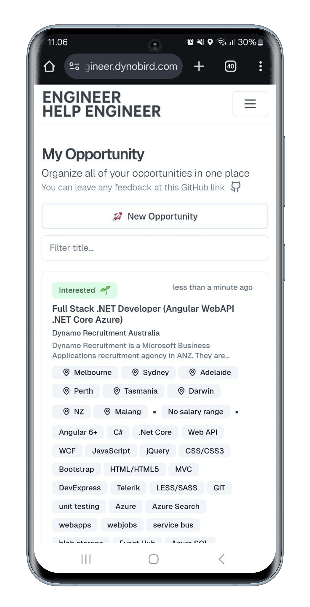

# Engineer Help Engineer

**Crowdsourced Job Opportunity Management System**  
Live at: [engineer-help-engineer.dynobird.com](https://engineer-help-engineer.dynobird.com)

## Demo Video

## 🚀 Project Overview

A centralized platform for job hunters to manage opportunities efficiently. Automatically extracts job details from links using AI-powered web scraping, helping you track applications, notes, salaries, and statuses across all your job hunting activities.

### Born from Necessity

Created after personal experience with layoffs (ex-Ruangguru engineer). Solves spreadsheet fatigue by:

- 📱 Mobile-first design for on-the-go management
- ✨ Automatic data extraction from job links
- 📈 Centralized tracking with status updates
- 💰 Note expectation tracking to prevent interview amnesia

## 🔥 Key Features

1. **Smart Link Processing**

   - Paste any job link → Auto-extract title/description using Puppeteer + Google Gemini
   - AI-powered information parsing from LinkedIn and other job boards

2. **Opportunity Management**

   - Status tracking pipeline (Interested → Preparing → Applied → Interview → Waiting Result → Rejected)
   - Note for expectation tracker
   - Mobile-optimized interface

3. **Job Hunter Toolkit**
   - Centralized application history
   - Prevent duplicate applications

## 🛠 Tech Stack

- **Frontend**: Next.js 13 (App Router)
- **Backend**: Supabase (PostgreSQL, Auth)
- **Web Scraping**: Puppeteer
- **AI Processing**: Google Gemini API
- **Hosting**: Vercel
- **Styling**: Tailwind CSS

## 🌟 Future Roadmap

- [ ] **Public Opportunity Sharing**
- [ ] **Community Comment System**
